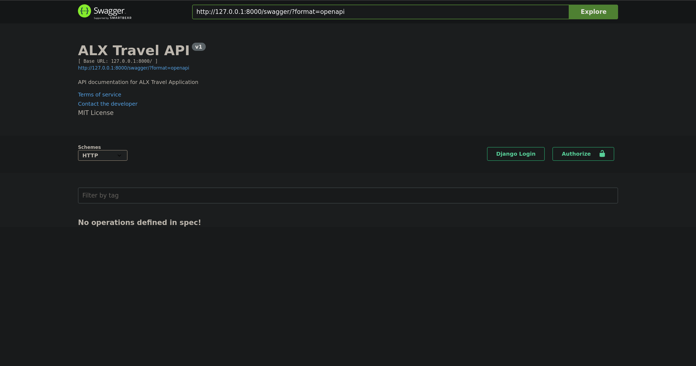

# ALX Travel App

A Django-based travel application with comprehensive API functionality for managing travel listings. This project provides a robust backend system for handling travel-related data, featuring MySQL database integration, asynchronous task processing with Celery, and API documentation using Swagger.

## Features

- RESTful API for travel listings management
- Built with Django 4.2 and Django REST Framework
- MySQL database backend
- Celery for asynchronous tasks
- API documentation with Swagger
- CORS support for cross-origin requests

## Prerequisites

- Python 3.10+
- MySQL 8.0+
- RabbitMQ (for Celery)
- Pipenv (for dependency management)

## Installation

1. Clone the repository:
   ```bash
   git clone https://github.com/yourusername/alx_travel_app.git
   cd alx_travel_app
   ```

2. Install dependencies using pipenv:
   ```bash
   pipenv install
   pipenv shell
   ```

3. Create a `.env` file in the project root with the following variables:
   ```
   DJANGO_SECRET_KEY=your_secret_key
   DB_NAME=your_db_name
   DB_USER=your_db_user
   DB_PASSWORD=your_db_password
   DB_HOST=localhost
   DB_PORT=3306
   ```

4. Apply database migrations:
   ```bash
   python manage.py migrate
   ```

5. Run the development server:
   ```bash
   python manage.py runserver
   ```

## API Documentation

The API documentation is available through Swagger UI at:
```
http://localhost:8000/swagger/
```



## Project Structure

```
alx_travel_app/
├── alx_travel_app/
│   ├── listings/         # Travel listings app
│   ├── settings.py       # Project settings
│   └── urls.py          # URL configurations
├── assets/              # Project assets
├── .env                 # Environment variables
├── manage.py
├── Pipfile             # Dependencies
└── README.md
```

## API Endpoints

- `/swagger/` - API documentation
- `/admin/` - Django admin interface

## Technologies Used

- Django 4.2
- Django REST Framework
- MySQL
- Celery
- RabbitMQ
- drf-yasg (Swagger/OpenAPI)
